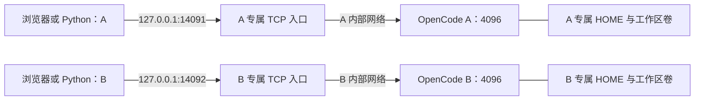

# OpenCode 一期部署验收报告

> 本报告是一期 **无模型部署的历史验收**。后续可选 DeepSeek V4.1 Flash 官方 API 测试的配置和独立证据见 [DEEPSEEK.md](DEEPSEEK.md)。此前生成的 `dist` 是当时的一期交付快照，源码更新不会自动改写它；后续重新导出的包可包含可选配置材料，但默认仍为无模型基线，不携带 API Key 或启用状态。

验收日期：2026-09-14（Asia/Shanghai）。范围：当前 Windows Docker Desktop 的 Linux 容器、两个独立客户机入口、合成会话与文件。服务和隔离验证通过；真实模型、业务数据和目标 Linux 服务器不在本次实测范围。

## 仓库与固定版本

| 项目 | 实际结果 |
|---|---|
| 新远程仓库 | https://github.com/frostdogstarscream/opencode-peixian |
| 仓库方式 | 用户确认的新独立仓库，GitHub 不显示 Fork 关系；保留官方历史和 upstream |
| 已推送内容 | 官方基线分支 `upstream-v1.18.30`；没有推送本期部署修改 |
| 本地目录 | `D:\Code\PeiXianDB\opencode` |
| 本地开发分支 | 一期验收当时为 `codex/peixian-server`，部署文件尚未提交；后续本地检查点以 `git log` 为准 |
| origin / upstream | 新的个人仓库 / `anomalyco/opencode` |
| 固定源码 | `v1.18.30` / `3104c1428ec91f809e5ab86631300de41eb6952e` |
| 基础镜像 | `ghcr.io/anomalyco/opencode:1.18.30@sha256:412b37a894bb937a0d5d6a1860789b9fd7d34a109334bec98a3f6ecf812bb442` |
| 运行镜像 | `peixian-opencode:1.18.30-r1`，`linux/amd64` |

运行镜像 ID：`sha256:e3c38b633a40c03f1fbc90583b0b3a7d282a3e07be0dda0aa257a4046413d275`。

Compose SHA256：`b2605512828e0ee8e90ed7755a5bac85f17ac67344bc5c19360f1180ce5801a1`。

官方发布二进制没有修改或重新编译。项目镜像增加普通用户、启动和健康检查、固定目的 TCP 转发，以及冷启动所需的预装依赖。旧的 `opencode_moblie` 未使用或修改；父目录已有工作流演示材料保留。

## 实际拓扑与访问



Docker 的 internal 网络在本环境中不发布宿主机端口。根据用户明确批准的调整，使用两个专属 TCP 入口，共四个长期运行容器。OpenCode 仅接自己的内部网络；入口各接自己的普通入口网络及对应内部网络，关闭 IP 转发，固定转发到自己的 OpenCode。入口没有密码文件、HOME 或工作区挂载，不提供可变目的地址或 HTTP CONNECT。

| 实例 | 浏览器和 Python 入口 | 用户名 | 密码位置（不写入报告） |
|---|---|---|---|
| A | http://127.0.0.1:14091 | `client-a` | 本机 `.secrets/client-a.password` |
| B | http://127.0.0.1:14092 | `client-b` | 本机 `.secrets/client-b.password` |

密码独立随机生成，重启不变，以只读文件交给启动脚本；缺少密码时拒绝启动。HOME、XDG、工作区、临时目录、数据库和认证边界均按实例独立。两个 OpenCode 各限制 2 CPU、2 GiB 内存、256 进程，普通 UID/GID 10001，只读根文件系统，移除 capabilities，启用 no-new-privileges，日志轮转，unless-stopped 重启策略。

## 服务与隔离验证结果

| 验收项 | 实测结果 | 证据 |
|---|---|---|
| 健康、版本与 HTTP 访问 | A/B 返回健康状态和 1.18.30；最终四个项目容器健康 | `evidence/api-isolation.json` |
| 认证隔离 | 无凭据、错误密码、A 凭据访问 B 和反向交叉均被拒绝 | 同上 |
| 会话与 SSE 隔离 | 各自创建唯一合成会话；列表、直接查询另一实例会话 ID、事件观察窗口均未泄漏另一实例内容 | 同上 |
| 文件与运行环境隔离 | 实际写入/读取合成文件；检查卷归属、HOME/XDG、临时目录、非 root、capabilities、资源限制 | 同上 |
| 网络边界 | 核验 OpenCode 无外部默认路由；自身入口连通，跨实例容器/入口及公网 TCP 探测被阻断；发布地址为回环 | 同上 |
| 重建与独立性 | 单独停止、启动和重建 A；会话、文件、凭据与卷保留，B 保持可用 | 同上，91 项检查全部通过 |
| Windows 操作脚本 | 实际执行 `manage.ps1 stop/start/recreate -Client client-a`；25 项通过，B 连续 21 次健康及容器 ID 采样全部正常 | `evidence/windows-lifecycle.json` |
| 空卷无公网冷启动 | 用独立临时项目和此前不存在的四个数据卷启动同一镜像；会话初始为空，认证/文件/HTML/本地资源通过，没有运行期依赖下载要求 | `evidence/cold-start.json`，45 项通过 |
| 原生浏览器 | 两个独立 Chromium 上下文、独立 HTTP 凭据；打开 /workspace、各自会话及合成文件内容；刷新后均无控制台错误 | `evidence/browser.json` 及两份 browser-client JSON/PNG |
| 无浏览器公网资源依赖 | 首次导航前关闭浏览器缓存、阻止 service worker，网络限定自身入口；实际 JS/CSS/字体/worker 返回 200，存在传输字节 | `evidence/browser.json` |

浏览器截图已人工视觉核对：[A](evidence/browser-client-a.png)、[B](evidence/browser-client-b.png)。截图仅包含合成标记，无密码和业务数据。

A 的 Windows 启停补验过程中，A 浏览器出现了 9 条预期的健康检查/SSE 断连错误；恢复并刷新后两边均为 0 条错误。B 连续可用的证据来自独立 HTTP 健康与容器 ID 采样。网页中的文件内容位于 Shadow DOM，浏览器断言使用支持 Shadow DOM 的实际文本定位器。

上述数字是各脚本的检查项数，包含重复验证，不代表互不重复的业务用例数量。API 报告的未验证列表针对单份脚本；空卷冷启动和浏览器的补充结果以上述独立报告为准。事件隔离为记录的测试观察窗口结果。

宿主机仅发布 `127.0.0.1`，本期两客户机由本机不同浏览器上下文和凭据模拟。未使用第二台物理电脑进行真实局域网入站探测，因此不把配置检查等同于物理客户端实测。凭据代表实例访问权，本期没有物理设备绑定。隔离采用同一 Docker 宿主机内的独立容器、网络和持久卷。

## 数据保留与环境处理

主项目 `peixian-opencode` 保持运行。冷启动副本验证后仅停止，容器、网络、空卷验收后产生的合成数据保留，不自动删除。副本项目：`peixian-opencode-cold-20260914072918-1d564ef46911`。再次执行冷启动会创建另一个唯一副本，需由管理员按保留策略管理这些测试资源。

初始化时 Docker Desktop Linux 引擎不能启动，原因为运行期 IPC reparse socket 状态异常。修复只备份并重建两个经检查仅包含 IPC socket 的运行目录，未删除原目录；未重置 WSL/VHDX、未清理镜像/持久卷、未修改 Docker 设置。Linux 引擎恢复后原有 7 个运行容器恢复，另 1 个原停止容器仍保留。之后生命周期操作仅针对本项目。

密码保存在 Git 忽略且限制访问的 `.secrets` 下，验收日志与发布包不输出或收录密码。普通停止和重建不删除数据卷。备份前停止目标实例并同时保存 HOME、工作区和对应凭据；详细操作见 [README](README.md)。

## 交付与复现

部署文件集中在 `deploy/peixian`：Compose、固定基础镜像 Dockerfile、启动/健康检查/TCP 转发脚本、Windows/Linux 操作脚本、httpx 示例、自动验收、冷启动脚本、vLLM 未启用模板和证据文件。

```powershell
# 在 deploy/peixian 运行；初始化和正常重启不会更换已有密码
.\manage.ps1 -Action status
.\.venv\Scripts\python.exe .\client.py --client client-a --title SYNTHETIC-demo --events-seconds 10
.\manage.ps1 -Action verify -Lifecycle
.\.venv\Scripts\python.exe .\cold_start.py
.\manage.ps1 -Action export
```

导出脚本检查当前镜像、平台、Compose 和三个主验收报告匹配后才导出。交付文件为 `dist/peixian-opencode-1.18.30-r1-linux-amd64.tar`、`dist/peixian-deployment.zip` 及各自 SHA256。一期 ZIP 包含部署文件、脱敏证据和纯 Python 离线 wheels，不包含本机凭据、浏览器配置、持久卷或 Git 工作区。更新后的打包白名单还收录可选 DeepSeek 的文档、脚本、配置及单独脱敏证据；这些材料不改变本报告的历史验收范围，也不会启用模型，详见 README 的重新导出说明。镜像 TAR 独立交付。包内 `manifest.json` 记录文件摘要、源码基线和经验证的镜像身份；镜像归档逐一核对 OCI 描述符及 blob 摘要。

目标 Linux 迁移步骤见 README：先校验两个归档的摘要，导入镜像、解压 ZIP，再初始化新凭据并 `--pull never` 启动。要求 amd64、Docker/Compose、Python 3.11+（建议 3.12）、venv 和 ACL 工具。Linux 初始化显式授予容器 UID 10001 密码只读 ACL，组和其他用户无权限；该脚本已做语法检查，但尚未在目标原生 Linux 主机进行迁移验收。

## 一期验收未执行的真实模型联调

- 一期验收时没有连接真实 vLLM、DeepSeek V4 Flash 或任何其他模型；没有提交模拟模型回答。
- 没有真实推理、流式输出、取消请求、工具调用效果和业务分析能力验收。
- 没有数据插件、MCP、业务 Skill、统一登录、动态实例分配或物理设备绑定。
- `enabled_providers: []`，自动更新和分享关闭，不启用默认/自定义插件，禁止模型元数据刷新和运行期依赖下载路径。
- `config/vllm.example.json` 仅标出 OpenAI 兼容 /v1 地址、实际 served model ID 和私密密钥的配置位置。一期基线启动脚本使用无模型配置，单独修改模板或 HOME 配置不会启用模型。

下一阶段需要明确允许的内网 vLLM 网络路径、每实例模型凭据和适配依赖，再进行真实模型和业务功能联调。
