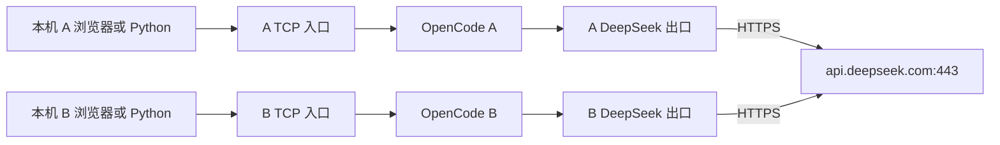

# DeepSeek V4.1 Flash 本机测试配置

在一期部署基础上增加可启停的 DeepSeek 官方 API 测试配置。模型使用 `deepseek-flash`，界面名称为 **DeepSeek V4.1 Flash**。官方 2026-09-10 公告说明该正式模型 ID 对应 V4.1 Flash：https://www.deepseek.com/en/news/deepseek-v4-1-flash/ 。本次也用实际账号的 `/models` 返回值核对了 ID。

## 当前入口与使用

A：http://127.0.0.1:14091，用户名 `client-a`；B：http://127.0.0.1:14092，用户名 `client-b`。浏览器登录密码仍为各自原来的 `.secrets/client-a.password` / `client-b.password`，没有更换。首次进入可通过“添加项目”打开 `/workspace`，随后新建会话即可使用默认的 DeepSeek V4.1 Flash。

这次接入的是 DeepSeek 官方公网 API。发送的提示词和模型使用的上下文会交给该官方服务；自动验收只使用合成标记与专门创建的测试文件。A/B 的本地会话、文件、登录和网络隔离保留，但本次两个出口使用同一枚用户提供的 API Key，计入同一个官方账号额度。实际计费以官方控制台为准。

## 配置与密钥

- `compose.deepseek.yaml` 是可选覆盖配置，保持一期 `compose.yaml` 和已导出的无模型镜像不变。
- `config/deepseek.json` 将主模型、辅助模型、标题、摘要和压缩均固定到 `deepseek/deepseek-flash`，仅允许该模型。
- 使用官方二进制已内嵌的 `@ai-sdk/openai-compatible`，没有运行期安装模型插件。
- 测试默认关闭 thinking；32K 上下文、2048 输出是本机保守预算，不是模型的最大能力声明。当前仅启用文本输入，没有做视觉输入验收。
- 两份 API Key 位于 Git 忽略且限制访问的 `.secrets/client-a.deepseek-key` 和 `.secrets/client-b.deepseek-key`。真实值只给对应出口容器只读挂载。
- OpenCode 内仅配置 `relay-injected` 占位符和内部转发地址，不把真实模型密钥交给 OpenCode 配置 API 或 agent 工具环境。

## 网络边界

长期运行容器由 4 个变为 6 个：两个 OpenCode、两个原有 TCP 入口、两个 DeepSeek 出口。



每个 OpenCode 仍只连接自己的 internal 网络，无直接公网默认路由。各出口连接自己的内部网络和各自的普通入口网络，无公开端口，不挂 HOME/工作区，也不允许 IP 转发。内部请求使用独立网络上的 HTTP，出口到官方 API 使用验证证书和主机名的 HTTPS。

出口代码固定访问 `api.deepseek.com:443`，仅接受 `GET /v1/models` 与 `POST /v1/chat/completions`；后者只允许 `deepseek-flash`。不提供 CONNECT，不接受可变目标地址，不跟随重定向，不记录请求正文、认证头或密钥。流式响应分块及时转发。每出口最多 4 个并发连接，请求正文上限 8 MiB。

出口容器本身具有普通网络路由；目的限制由固定网关代码实施，不能把它描述为防火墙层面仅放行一个域名。A/B 没有共同的 Docker 网络或共享数据卷。

## 操作与回退

在 `deploy/peixian` 下执行：

```powershell
# 当前六个服务状态
.\deepseek.ps1 -Action status

# 单独重启 A，配置重新从本机文件读取
.\deepseek.ps1 -Action restart -Client client-a

# 真实模型验收，会消耗少量官方 API 额度
.\deepseek.ps1 -Action verify

# 回到一期无模型状态；停止两个模型出口，保留全部会话、卷和密钥
.\deepseek.ps1 -Action disable

# 再次启用 DeepSeek 模型测试
.\deepseek.ps1 -Action enable
```

`.runtime/deepseek.enabled` 记录当前启用状态。未启用时，直接执行 `start/restart/recreate` 会拒绝操作，必须先执行 `enable`，避免运行配置与模式标记不一致。启用时，原有 `manage.ps1` 的状态/启停/重建/验收操作自动交给 DeepSeek 管理脚本，避免普通重建意外恢复无模型配置；此状态下阻止覆盖一期镜像导出。`-Action verify` 在模型配置下会进行真实付费 API 验证。

`dist` 中之前生成的镜像 TAR 和部署 ZIP 仍是已经验收的 **一期无模型交付包**，未添加本机 API Key，也未改写成这次公网模型配置。该新增配置目前针对当前 Windows Docker Desktop 实测，尚未执行原生 Linux 搬迁；Linux 密钥文件读取需要单独为出口 UID 10001 设置只读权限。

## 验收记录

2026-09-14 当前实测：真实模型与身份/内容隔离 **56 项通过**；接入后的容器/网络边界 **42 项通过**。A/B 各发送 2 个用户 prompt（短回答一次、真实 read 工具任务一次），没有脚本重试；每实例工具任务记录恰好一次 read completed，最终回答包含各自随机文件标记。服务端消息记录合计 15804 tokens，包含输入缓存等计数，不等同于收费金额。

- `evidence/deepseek-preflight.json`：真实账号认证和正式模型 ID 查询。
- `evidence/deepseek-network.json`：接入后的六容器权限、网络与拒绝其他路径/模型检查。
- `evidence/deepseek-live.json`：真实短回答、SSE、工具读取合成文件、身份/会话/密钥隔离，以报告内实际状态为准。
- `evidence/deepseek-lifecycle.json`：补充启用状态保护前的历史实测，实际验证管理入口 up、全部停止、恢复无模型四服务、重新启用模型六服务，**24 项通过**；全部已有会话、合成文件与卷保持一致，没有新增模型请求。
- `evidence/deepseek-browser.json`：两个独立浏览器均显示 DeepSeek V4.1 Flash、各自已完成的 read 操作和真实合成回答，截图已视觉核对。
- `evidence/deepseek-browser-client-a.png` / `b.png`：原生网页实际显示。

一期 `ACCEPTANCE.md` 记录无模型部署时的历史结果；本次结果用上述单独证据记录，不把历史验收改写成真实模型已测试的证据。没有连接自部署 vLLM、建设业务插件、MCP 或业务 Skill。
