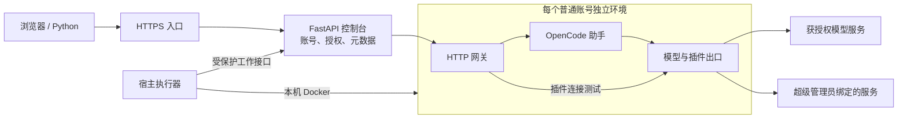

# 通用 Agent 平台 V1

Agent 工作台基于现有 SolidJS + FastAPI + OpenCode 1.18.30，提供可部署在单台服务器上的多账号助手平台。管理员创建普通账号后，平台准备独立环境；用户登录即可对话、上传文件、选择授权模型和技能，配置并使用已授权插件。

本版本从三角色检查点 `e924f1af27a16e52e589b016f4eb52da259ba5d0` 创建 `codex/generic-agent-platform`，保留既有沛县分支、API 前缀和运行数据。原正式项目 A～G 方案继续作为后续业务参考，不作为本通用版本的前置条件。

## 文档入口

| 使用者 | 文档 |
| --- | --- |
| 普通用户、管理员、超级管理员 | [通用使用手册](GENERIC_USER_GUIDE.md) |
| 插件与业务能力开发者 | [插件开发手册](PLUGIN_DEVELOPER_GUIDE.md) |
| 单服务器部署、升级与恢复 | [Linux 部署手册](server/README.md) |
| Python 接入 | [Python 示例](examples/platform-python.py) |
| API 契约 | [OpenAPI](../../services/peixian-control/docs/openapi.json) |
| 验收证据和未执行项 | [验收报告](GENERIC_ACCEPTANCE_REPORT.md) |

## 产品范围

普通用户有“对话、我的文件、我的技能、我的插件、个人设置”五个入口，无需创建项目或选择服务器目录。同一账号更换浏览器或电脑仍使用相同的服务端环境。产品名称、简称和介绍在部署配置的 `product` 中统一设置。

三角色边界：

| 角色 | 可用管理能力 |
| --- | --- |
| 超级管理员 `super_admin` | 用户、模型、操作记录、插件发布与授权、Skill 模板、服务连接、独立环境维护 |
| 管理员 `admin` | 普通用户创建／停用／重置密码、模型管理及授权、脱敏操作记录 |
| 普通用户 `user` | 自己的对话、文件、个人 Skill、获授权插件的个人配置、访问令牌 |

管理员账号不自动分配助手环境。管理角色不因身份自动获得他人会话、文件正文或明文凭据。个人 Skill 与模板复制保持现有方式，本版没有公共 Skill 审核发布状态机。

## 请求与运行环境

控制台、HTTPS 入口不挂 Docker socket；宿主执行器有本机 Docker 管理权限，通过固定任务契约开通和管理环境。每个普通账号仍使用三个容器，各自持久卷与网络。默认最多四个普通账号同时运行，资源预算由同一配置传给控制层和执行器。

模型和插件分别使用出口中的显式路由。插件以连接别名调用平台客户端，客户端仅拿到账号绑定的调用标识和委托令牌。平台维护服务地址、公共鉴权、方法及路径范围；公共服务凭据不进入插件代码、个人参数、Skill 或普通用户接口。

连接变更沿用配置版本发布机制：生成新版本、等待空闲、重启受影响实例、验证加载，失败保留上一版本。用户界面会显示待生效状态。实例重启阶段可能短暂无法查询其历史，其他账号继续使用。

## 扩展方法

Skill 写工作方法与调用规则；插件写取数、计算、处理代码。首版采用经超级管理员审核的预打包 `.mjs` 文件和静态资源，不在服务器现场安装任意 npm 依赖。插件不是不可信代码沙箱；平台限制加载来源和账号运行边界，发布前仍需审查插件实现。

示例 [records-plugin](examples/records-plugin/) 和 [合成接口](examples/records-api.py) 展示服务连接、个人参数、实际工具调用与版本切换。该接口仅返回固定合成资料，不携带真实业务数据。

以后需要案件、部门或业务记录级权限时，应在插件对应的数据服务中实施身份映射和授权检查。Skill 中的文字说明不是数据接口的权限控制。平台默认不建设案件、资料域、业务审批、独立业务 Run、结构化业务数据库或固定报告流程。

## 交付与维护约定

本版支持单机 Docker Compose、SQLite、单控制进程与宿主执行器。HTTPS 证书由部署方提供，Python 需使用其信任链。离线包包含预构建应用镜像、宿主 Python wheels、配置与脚本、示例和文档；不含本机账号、密码、模型密钥、会话、用户卷或备份。

Ubuntu 24.04 x86_64 主机需预装 Docker Engine／Compose v2、Python 3.12／venv、ACL 与系统 CA。完全离线时需另行准备对应操作系统安装介质或系统包。本版没有高可用集群或恢复时限承诺。

全量备份必须包含控制卷、用户卷、发布目录及匹配密钥。备份文件属于私密数据，不能随安装包分发。恢复要求新部署标识、空目标目录及无冲突资源；校验失败不覆盖既有数据。迁移和恢复的具体命令见部署手册。
