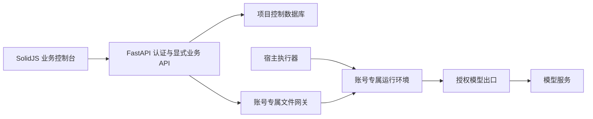

# 框架架构与业务扩展约定

## 定位

目标是让新项目可以复用账号、模型、对话、文件和 Agent 能力，并用统一方式增加业务页面、接口和工具。与“若依式快速开发”相似的是通用底座与业务代码分离，不要求切换成 Java，也不把 AI 平台的安全边界交给菜单配置。

## 当前结构



项目生成器产生新的源码目录与配置。运行时仍是一账号一环境，同一账号换电脑访问同一套数据。项目隔离和账号隔离是不同层次：前者分离部署身份与密钥，后者分离会话、文件、技能、插件配置和运行凭据。

## 三类扩展

| 类型 | 解决什么问题 | 代码与权限边界 | 当前状态 |
| --- | --- | --- | --- |
| 业务模块 | 页面、菜单、业务实体、接口及业务权限，例如资料台账 | 由项目开发者编写并随应用发布，接口仍校验身份与数据归属 | 约定已建立，通用注册器和生成器待建设 |
| Agent 插件 | 模型可以调用的真实数据接口或操作工具 | 管理员发布受控包，用户只能安装获授权版本并填个人配置 | 已有发布、授权、配置、启停及版本生效能力 |
| Skill | 规定分析过程、输出格式、业务注意事项 | 用户文本指令与参考资料；不因此获得额外系统权限 | 已有可视化创建、版本恢复和加载 |

不能用 Skill 代替数据权限，也不应为了增加一个业务页面而编写 Agent 插件。后续模块注册器采用显式开发者清单，不扫描或执行用户上传目录中的 Python/JS。

## 开发约束

1. 所有用户资源必须带服务端确定的 owner/account 标识。请求中的账号、文件路径、模型地址或容器标识不能替代登录身份。
2. 菜单显隐只解决体验。后端对每项操作和每个资源做权限及归属检查；模板生成的接口也不允许省略。
3. 业务接口拟采用 `/api/business/v1/<module>`；现有 `/api/console/v1` 保持平台职责。新前缀是约定，当前没有自动注册任意模块。
4. 业务数据库需采用明确的 schema migration。当前平台 SQLite 仍沿用既有初始化方式；在引入通用实体前先建设可追踪迁移。
5. 插件和 Skill 使用清单/配置做扩展。OpenCode 托管补丁集中保留，不把业务判断散落到其会话和模型核心。
6. 普通用户错误使用业务提示和排查编号；日志不写密码、密钥、文件正文或原始模型提示。
7. 本地生成与发布是两个动作。脚手架不自动发布代码、不接真实数据库、不注册远程仓库。

## 推荐业务项目结构（下一阶段）

```text
modules/
  records/
    module.json       # 开发者清单：ID、版本、导航、权限项
    backend/          # router、service、repository、schema
    frontend/         # 页面、表单、列表
    migrations/       # 业务实体版本迁移
    tests/            # 权限、归属与主要业务流程
business/
  plugins/            # 管理员发布包源码
  skill-templates/    # 可复制技能模板
```

以上为目标结构，不是已经可加载的运行约定。第一个模块建议使用不连接真实业务系统的“资料台账”，验证从新增、列表、详情到授权和导出的完整开发链路，再抽取生成模板。

## 升级策略

保留上游 OpenCode 历史、许可证和固定内核基线。框架补丁独立提交，业务项目记录模板来源提交。首版生成器导出干净源码，不自动同步上游；后续升级要比较框架版本、数据库迁移、插件合同和托管模式测试，不能直接覆盖客户代码或数据。
