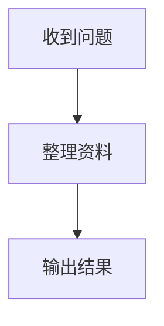

# 用户问答执行过程与研判输出：前后端对齐说明

日期：2026-09-20\
前端工作区：`/root/PeiXianDB/frontend-alignment`，分支 `frontend-alignment`\
范围：本轮仅修改前端；本文供后端下一轮补充接口及联调使用。

## 一、结论与优先级

| 优先级 | 项目 | 当前结论 | 负责方 |
| --- | --- | --- | --- |
| P1 | 同轮多个“执行过程” | 前端按每条助手消息分别渲染。本轮按相邻用户提问后的助手消息合并为一个入口，并支持步骤二级展开。 | 前端已改 |
| P1 | 实际 Skill 名称、步骤结果 | 公开消息中的 Skill 标题固定为“使用技能”；持久步骤的名称也固定为“使用技能”，摘要为空。不能根据“已选择”推断“实际调用”。 | 后端补充契约 |
| P1 | 最后的下一步建议 | 可信 `analysis_result.next_steps` 在后端结果组装时固定为空；前端只有非空时展示。 | 后端补充内容 |
| P2 | 资料缺口的含义 | 当前既包含固定的观察范围/资料限制，又包含获取或核对未完成；前端继续显示，不能将其统一理解成测试数据缺失。 | 后端区分语义 |
| P2 | 渐进输出 | 当前有 SSE 失效通知、临时正文覆盖和消息重取，属于渐进显示；不是浏览器直接接收且可恢复的逐字增量流。 | 前端本轮优化；严格逐字流需后端 |
| P2 | 错误背景图 | 本轮移除错误图片引用及配套全局覆盖，登录页恢复旧图。 | 前端已改 |

## 二、现有接口及前端接入情况

| 所属界面 | 接口/字段 | 当前使用方式 | 本轮接入结果 | 剩余限制 |
| --- | --- | --- | --- | --- |
| 用户对话 | `GET /sessions/{sid}/messages`，`items[].info.role` 与 `parts[]` | 按用户消息边界把后续相邻助手消息归为一轮；每轮仅一个执行过程入口 | 已接入；需目标场景复核 | 消息没有显式 `run_id`/`turn_id`，历史分组依赖消息顺序 |
| 用户对话 | `parts[type=tool].id/state.status/state.title/details.inputs/details.outputs` | 步骤二级展开；仅显示后端已公开、已脱敏字段 | 已接入；空详情有明确提示 | Skill/插件具体名称及完整结果通常未公开；工具 Part 不含时间 |
| 用户对话 | `GET /sessions/{sid}/runs` 与 `/runs/{rid}/events` | 保留运行状态、停止和报告；去掉与消息内执行过程重复的顶部步骤清单 | 已接入 | `RunEvent` 未公开与 Tool Part 的稳定关联键；不能安全地把两种记录逐条合并 |
| 用户对话 | `GET /events`，`resources=[messages]`，消息查询 | 收到变更通知后重取消息；断线重新读取持久历史；对进行中输出按需滚动 | 已接入 | SSE 只发资源变更，不发可重放正文增量；断线期间依赖持久消息补齐 |
| 研判结果 | `parts[type=analysis_result].data.next_steps` | 非空时作为最后的“下一步建议”直接显示 | 前端已接入；当前后端值为空 | 无内容时前端不编造业务建议 |
| 研判结果 | `analysis_result.missing`、`GET /sessions/{sid}/runs/{rid}/evidence` 的 `missing` | 保留“资料缺口与局限”，并按同一 Run 合并去重 | 已接入 | 目前缺口类型未结构化，可能被误解为执行失败 |
| 登录/所有业务和管理页 | 静态图片及 CSS | 撤销错误的全局背景和侧栏/抬头覆盖，登录恢复 `peixian-login-story.webp` | 已处理 | 待 UI 提供正确图片后另行优化 |

## 三、请后端补充的执行过程契约（P1）

当前源码行为：`public_messages` 将 `skill` 工具标题统一改为“使用技能”，其他插件改为“调用已启用的插件”；`track_messages` 记录的 RunEvent 亦使用通用名称。只读统计当前库中 120 条执行事件，`input_summary` 和 `output_summary` 均无非空值；12 条 Skill 事件没有 `capability_id`。因此前端无法准确显示实际调用名称或每一步结果。

建议在经授权且脱敏的公开步骤数据中提供：

1. `run_id`、稳定的 `step_id` 或 `call_id`，并在消息 Tool Part 与 RunEvent 中使用同一个关联键；历史会话也需可重读。
2. `step_type`、`status`、开始/结束时间、实际调用的能力 `capability_id` 与**执行时冻结的显示名称及版本**。未调用的已选择能力不能标成已调用。
3. 白名单式的 `input_summary`、`output_summary`、可展示的结构化 `result`、结果截断标志、记录数及证据引用；不暴露路径、密钥、内部命令、未授权资料或原始模型工具输出。
4. `pending/running/completed/failed/cancelled` 的统一含义和错误的用户可见描述；同一调用更新时保持稳定标识与顺序，便于前端原位更新而非重复追加。

前端拿到上述字段后可展示“技能/插件名称 → 执行状态 → 脱敏输入与结果”，并把实时/历史记录按 `run_id` 精确归入同一问答。**在当前契约下，具体 Skill 名称、完整执行结果及 Tool Part 的准确步骤时间无法由前端可靠实现。**

## 四、下一步建议与资料缺口契约（P1/P2）

后端 `run_scheduler.py` 组装可信 `peixian.analysis-result` 时固定赋值 `next_steps: ''`，因此最后一节不出现不是单纯因为测试资料不完整。请在可信、可追溯的结果生成流程中填充建议，明确建议依据及安全边界；资料不足时可返回明确的“无可验证建议”状态，勿让前端根据自由文本猜测。建议与具体证据/结论建立引用，并区分待补充资料、待人工核查、可执行业务动作。

`scenario_presentation.py` 即使资料核对完整，也会加入“观察范围仅覆盖两个日期”等固定局限；另外会在资料未取得/核对未完成时加入提示。建议把 `missing` 拆分为结构化类别，例如 `scope_limit`、`source_missing`、`verification_pending`，保留文本和证据引用，使前端能够分别提示“研判局限”与“待补资料”。旧版 `missing: string[]` 建议在过渡期继续兼容。

## 五、渐进输出与严格流式输出（P2）

现有 `GET /events` 返回 SSE `change` 通知（包括 `resources: ["messages"]`），前端随后调用 `GET /sessions/{sid}/messages`。后端消息接口可叠加进程内临时正文，断线时以持久消息重新同步。这能让已到达的文本渐进显示，但通知本身不含正文，不能保证逐字延迟、完整重放或跨进程连续性。

若要求严格逐字流，建议设计单独的**已脱敏**增量契约：包含 `session_id`、`run_id`、`message_id`、`part_id`、单调序号/游标、正文增量、完成标志；明确断线续传或以快照重同步、截断限制、账号授权与撤销、慢消费者策略。前端不可直接消费未脱敏的模型原始事件，也不应以定时“打字动画”假装真正流式。

## 六、下一轮联调建议与验收样例

1. 同一用户问题产生三条助手消息、三次 Tool 调用：页面只有一个执行过程入口，含三条可独立展开的步骤；刷新后结构一致。
2. 选择两个 Skill 但实际仅调用其中一个：只标识真实调用的 Skill；未调用项不出现在执行记录中。
3. 返回含安全结果、结果被截断、无可展示结果及执行失败四类步骤：前端分别展示详情、截断说明、空详情提示和失败状态。
4. 返回非空 `next_steps`，确认它在研判末尾出现；返回空值时确认不生成虚构建议；同时检验固定局限与待补资料的分类。
5. 连续正文更新、用户上滚阅读、SSE 断开重连、切换历史会话：不得重复内容、跳到底部或自动重发生成请求。

本轮仅做前端构建与这些针对性检查，不代表完整业务验收；后端开发完成后请回传新增字段的 OpenAPI/样例、脱敏规则、历史兼容策略与上述样例的测试结果。

## 七、2026-09-20 用户对话布局及 Markdown 流程图补充

本轮仅调整用户端前端：移除对话上方的“我的助手”、标题／模型及执行状态三条横栏，让正文区域向上扩展；模型选择移到发送框下方、发送按钮左侧，保持原有 `model_id` 提交行为；文件关联入口改为回形针图标，仍调用原文件选择弹窗。按需启动账号在助手未就绪时可从输入区的精简入口启动，其他页面保留原有助手状态栏。顶部的重跑、刷新证据、导出报告等按钮不再展示，但对应后端接口没有删除或变更；若业务仍要求显式操作入口，需与 UI 再确认放置位置。

发布记录：前端 `bun typecheck`、`bun run build`、差异格式检查通过；基于 `agent-platform-control:event-diagram-v151-final-20260920` 的不可变镜像派生 `agent-platform-control:frontend-chat-compact-final-20260920` 并已更新容器。页面及新 JS 返回 HTTP 200，`alignment-a` 与 `alignment-b` 均恢复为 `ready/open`。未进行全量业务验收或登录后的流程图交互验收；后端代码、接口和数据库结构均未在本轮修改。

普通 Markdown 原先只把 Mermaid 代码围栏显示为代码，不会绘图。本轮前端增加受限的简单流程图渲染：后端可在 `GET /sessions/{sid}/messages` 的助手 `parts[type=text].text` 中直接返回如下围栏，无须新增接口或 HTML/SVG 字段：

````markdown

````

前端仅识别 `mermaid`／`flowchart` 围栏内以 `flowchart` 或 `graph` 加 `TB/TD/BT/LR/RL` 开头的简单流程图；代码最多 4096 字符、60 行。渲染使用 Mermaid 严格安全模式并再次清洗 SVG，禁止脚本、链接、嵌入图片及交互指令；不符合条件或解析失败时保留原始代码，不伪造成已核实的业务流程。建议后端返回短小、无 HTML／外部链接的流程图，并同时保留文字说明及事实来源。已有的结构化“事件脉络图”仍使用独立的可信结果契约，两者不能混同；模型生成的 Markdown 流程图仅是展示文本，**不因此成为可信研判证据**。
